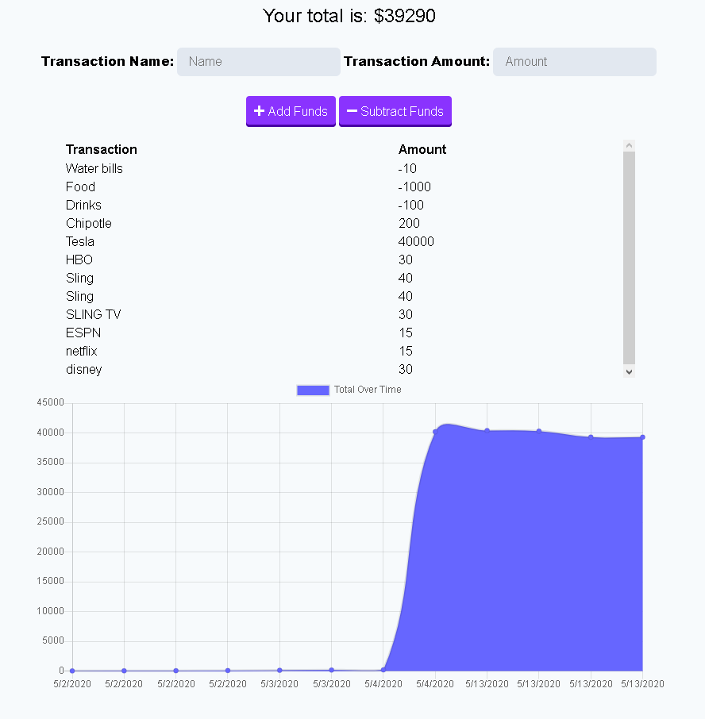

# PROGRESSIVE BUDGET

> Allows user to add expenses and deposits to their budget with or without an internet connection. When entering transactions offline, the total will be populated when brought back online. Useful when you are on the go and lack internet access.

## FUNCTIONALNITY

     1. Offline: Enter deposits and expenses offline.
     2. Online: Offline entries added to tracker.

As a result, the user is allowed a convenient and accessible method of offline access and functionality to their budget application.

Created with: HTML, CSS, Node.js, Express.js, Heroku, Charts.js, Mongoose, MongoDB, and jQuery.

## DEPLOYED APPLICATION

[APP DEMO, click here to view](https://mighty-hollows-81861.herokuapp.com/)

## SCREENSHOT

